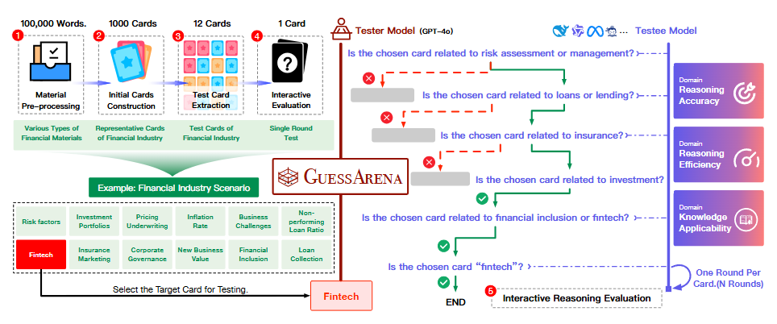
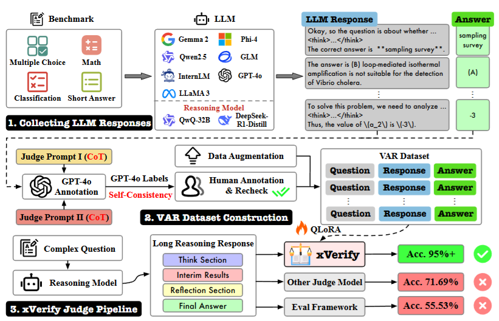
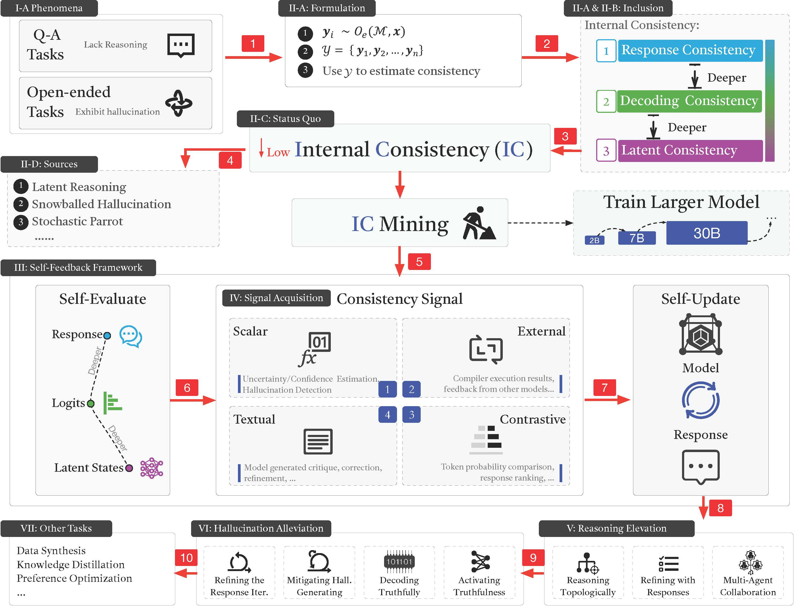

# Qingchen Yu

    

        
    

    

        

I am currently a Ph.D. student in Artificial Intelligence at Beihang University. My research interests mainly focus on large language models. 

<strong>Email:</strong> zhgyqc[at]163[dot]com
        

    

    <a href="https://scholar.google.com/citations?user=-soHkFYAAAAJ&hl=en">Google Scholar</a> | <a href="https://www.semanticscholar.org/author/Qingchen-Yu/2278590555">Semantic Scholar</a> | <a href="./assets/yqc_cv.pdf">CV</a> | <a href="https://github.com/Duguce">GitHub</a> <a href="https://huggingface.co/Duguce">Hugging Face</a> | <a href="https://x.com/zhgyqc_duguce">Twitter</a> | <a href="https://blog.csdn.net/LIGHTER_06">CSDN</a>

<h2 style="text-align: left;">Education</h2>

    

        

            <strong>Beihang University</strong>
            Beijing, China
        

        

            Ph.D. Student in Artificial Intelligence
            2025.09 - Present
        

    

    

        

            <strong>Shanghai University</strong>
            Shanghai, China
        

        

            M.Mgt. in Management Science and Engineering
            2022.09 - 2025.04
        

    

    

        

            <strong>Henan University of Economics and Law</strong>
            Zhengzhou, China
        

        

            B.Mgt. in E-commerce
            2018.09 - 2022.06
        

    

<h2 style="text-align: left;">Selected Publications</h2>

    * Contributed Equally; † Corresponding Author

    

        
    

    

        

            <strong>GuessArena: Guess Who I Am? A Self-Adaptive Framework for Evaluating LLMs in Domain-Specific Knowledge and Reasoning</strong> 
            <strong>Qingchen Yu</strong>*, Zifan Zheng*, Ding Chen*, Simin Niu, Bo Tang, Feiyu Xiong, Zhiyu Li† 
           ACL, 2025 <a href="https://aclanthology.org/2025.acl-long.534" style="color: #0066cc; text-decoration: none;">ACL Anthology</a> | <a href="https://arxiv.org/abs/2505.22661" style="color: #0066cc; text-decoration: none;">arXiv</a> | <a href="https://github.com/IAAR-Shanghai/GuessArena" style="color: #0066cc; text-decoration: none;">GitHub</a>
        

    

    

        
    

    

        

            <strong>xFinder: Large Language Models as Automated Evaluators for Reliable Evaluation</strong> 
            <strong>Qingchen Yu</strong>*, Zifan Zheng*, Shichao Song*, Zhiyu Li†, Feiyu Xiong, Bo Tang, Ding Chen 
           ICLR, 2025
            <a href="https://openreview.net/forum?id=7UqQJUKaLM" style="color: #0066cc; text-decoration: none;">OpenReview</a> | <a href="https://arxiv.org/abs/2405.11874" style="color: #0066cc; text-decoration: none;">arXiv</a> | <a href="https://github.com/IAAR-Shanghai/xFinder" style="color: #0066cc; text-decoration: none;">GitHub</a> | <a href="https://huggingface.co/collections/IAAR-Shanghai/xfinder-664b7b21e94e9a93f25a8412" style="color: #0066cc; text-decoration: none;">Models</a> | <a href="https://huggingface.co/datasets/IAAR-Shanghai/KAF-Dataset" style="color: #0066cc; text-decoration: none;">Dataset</a> | <a href="https://mp.weixin.qq.com/s/C5G-rpen9OM4MmBhrByTIQ" style="color: #0066cc; text-decoration: none;">WeChat Article</a>
        

    

    

        
    

    

        

            <strong>xVerify: Efficient Answer Verifier for Reasoning Model Evaluations</strong> 
            Ding Chen*, <strong>Qingchen Yu</strong>*, Pengyuan Wang*, Wentao Zhang†, Bo Tang, Feiyu Xiong, Xinchi Li, Minchuan Yang, Zhiyu Li† 
            arXiv, 2025
            <a href="https://arxiv.org/abs/2504.10481" style="color: #0066cc; text-decoration: none;">arXiv</a> |
            <a href="https://github.com/IAAR-Shanghai/xVerify" style="color: #0066cc; text-decoration: none;">GitHub</a> |
            <a href="https://huggingface.co/collections/IAAR-Shanghai/xverify-67e0f6f94c2dc334727da802" style="color: #0066cc; text-decoration: none;">Models</a> |
            <a href="https://mp.weixin.qq.com/s/Un59Wi_vQB5JBaLASQbHKw" style="color: #0066cc; text-decoration: none;">WeChat Article</a> |
            <a href="https://x.com/_akhaliq/status/1912419740393349234" style="color: #0066cc; text-decoration: none;">X Thread</a>
        

    

    

        
    

    

        

            <strong>TurtleBench: Evaluating Top Language Models via Real-World Yes/No Puzzles</strong> 
            <strong>Qingchen Yu</strong>*, Shichao Song*, Ke Fang*, Yunfeng Shi, Zifan Zheng, Hanyu Wang, Simin Niu, Zhiyu Li† 
            arXiv, 2024
            <a href="https://arxiv.org/abs/2410.05262" style="color: #0066cc; text-decoration: none;">arXiv</a> | 
            <a href="https://github.com/mazzzystar/TurtleBench" style="color: #0066cc; text-decoration: none;">GitHub</a> | 
            <a href="https://huggingface.co/datasets/Duguce/TurtleBench1.5k" style="color: #0066cc; text-decoration: none;">Dataset</a> | 
            <a href="https://tanghenre.com" style="color: #0066cc; text-decoration: none;">Demo</a> | 
            <a href="https://mazzzystar.github.io/2024/08/09/turtle-benchmark-zh" style="color: #0066cc; text-decoration: none;">Blog Post</a>
        

    

    

        
    

    

        

            <strong>Internal Consistency and Self-Feedback in Large Language Models: A Survey</strong> 
            Xun Liang*, Shichao Song*, Zifan Zheng*, Hanyu Wang, <strong>Qingchen Yu</strong>, Xunkai Li, Rong-Hua Li, Feiyu Xiong, Zhiyu Li† 
            arXiv, 2024
            <a href="https://arxiv.org/abs/2407.14507" style="color: #0066cc; text-decoration: none;">arXiv</a> | <a href="https://github.com/IAAR-Shanghai/ICSFSurvey" style="color: #0066cc; text-decoration: none;">GitHub</a> | <a href="https://mp.weixin.qq.com/s/fSc0Szi-zO6YVwp2oV8Uhg" style="color: #0066cc; text-decoration: none;">WeChat Article</a> | <a href="https://x.com/Ki_Seki_here/status/1836020241538908529" style="color: #0066cc; text-decoration: none;">X Thread</a>
        

    

    

        
    

    

        

            <strong>Grimoire is All You Need for Enhancing Large Language Models</strong> 
            Ding Chen*, Shichao Song*, <strong>Qingchen Yu</strong>, Zhiyu Li†, Wenjin Wang, Feiyu Xiong, Bo Tang 
            arXiv, 2024
            <a href="https://arxiv.org/abs/2401.03385" style="color: #0066cc; text-decoration: none;">arXiv</a> | <a href="https://github.com/IAAR-Shanghai/Grimoire" style="color: #0066cc; text-decoration: none;">GitHub</a> | <a href="https://mp.weixin.qq.com/s/YsMSy0vwxQtzPwWaCoPmzw" style="color: #0066cc; text-decoration: none;">WeChat Article</a>
        

    

<h2 style="text-align: left;">Honors and Awards</h2>

<ul>
  <li style="font-size: 18px;">Outstanding Graduate Award of Henan (2022)</li>
  <li style="font-size: 18px;">National Scholarship for Undergraduate Students (2021)</li>
  <li style="font-size: 18px;">National Second Prize in the China Undergraduate Mathematical Contest in Modeling (2020)</li>
</ul>

<h2 style="text-align: left;">Academic Services</h2>

<ul>
  <li style="font-size: 18px;">Reviewer for ICLR (2025-2026), CVPR (2026), ACM TIST, TMLR</li>
  <li style="font-size: 18px;">Volunteer for COSCon'25</li>
</ul>