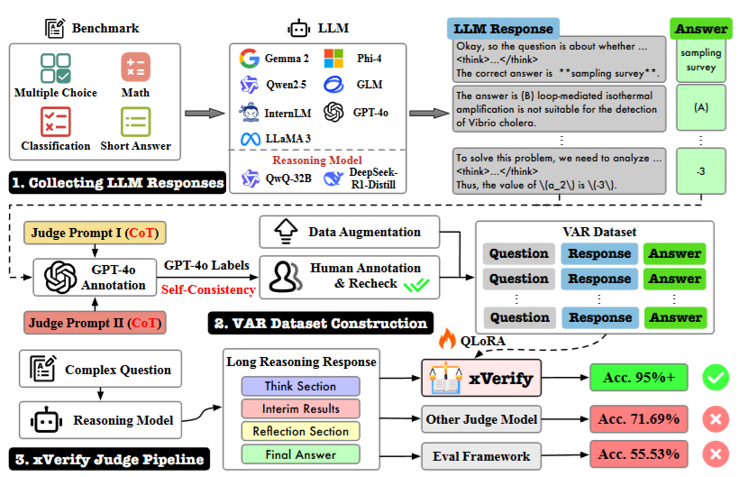
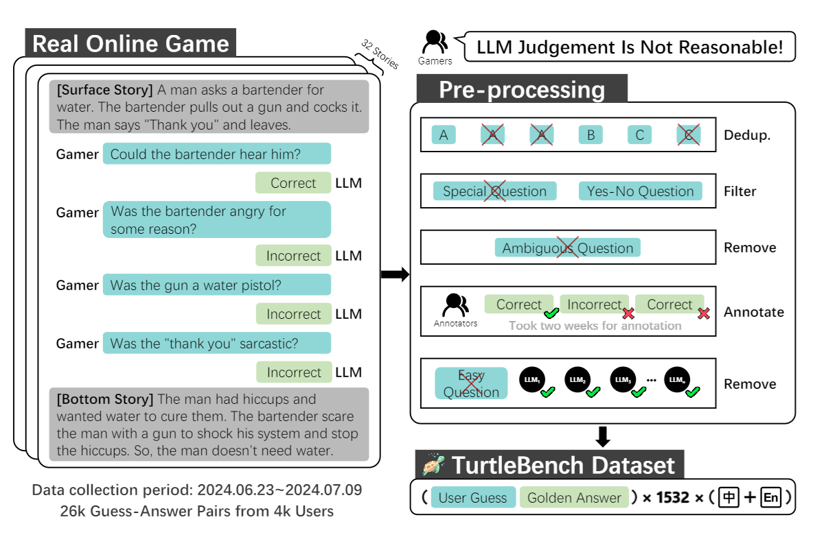
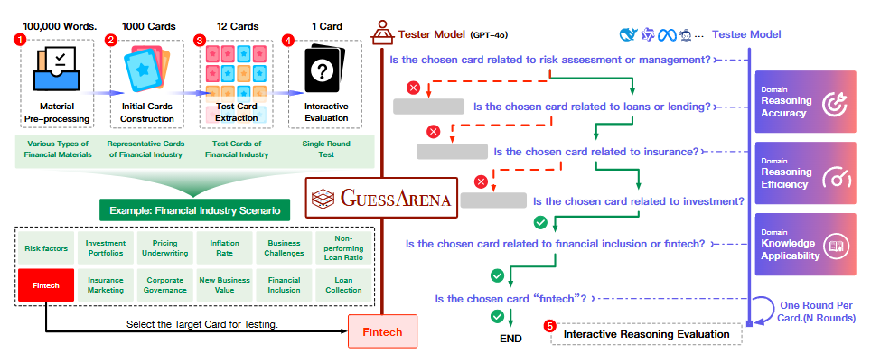
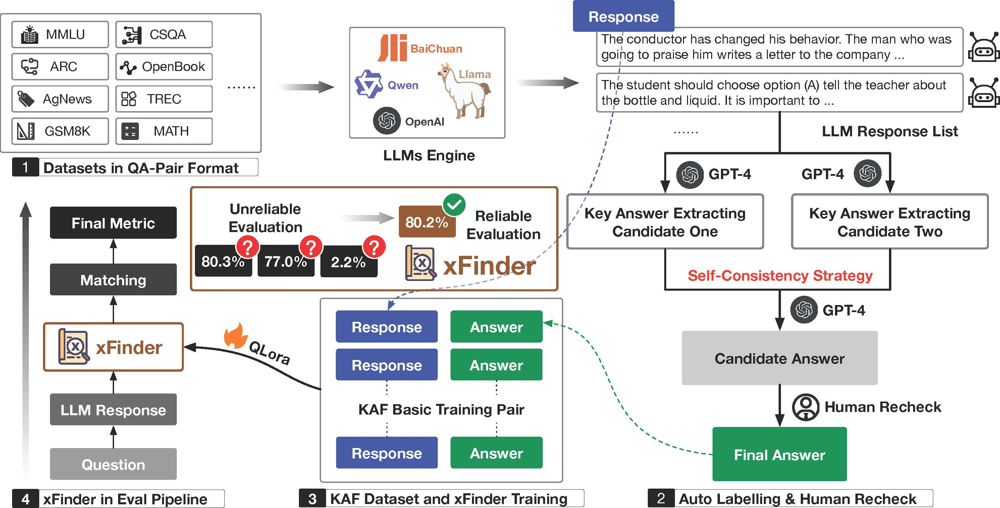

    
    

        <h1 class="hero-name">Qingchen Yu</h1>
        
Ph.D. Student in Artificial Intelligence &middot; Beihang University

        
My research interests mainly focus on large language models.

        
Email zhgyqc[at]163[dot]com

        

            <a href="https://scholar.google.com/citations?user=-soHkFYAAAAJ&hl=en"><i class="fa fa-graduation-cap" aria-hidden="true"></i>Google Scholar</a>
            <a href="https://github.com/Duguce"><i class="fa fa-github" aria-hidden="true"></i>GitHub</a>
            <a href="./assets/yqc_cv.pdf"><i class="fa fa-file-text-o" aria-hidden="true"></i>CV</a>
            <a href="https://x.com/zhgyqc_duguce"><i class="fa fa-twitter" aria-hidden="true"></i>Twitter</a>
            <a href="https://huggingface.co/Duguce"><i class="fa fa-smile-o" aria-hidden="true"></i>Hugging Face</a>
            <a href="https://dinq.me/qingchen"><i class="fa fa-link" aria-hidden="true"></i>DINQ</a>
        

    

<h2 class="section-title">Education</h2>

    

        

            <a href="https://ev.buaa.edu.cn">Beihang University</a>
            Ph.D. Student in Artificial Intelligence
        

        

            Beijing, China
            2025.09 - Present
        

    

    

        

            <a href="https://en.shu.edu.cn">Shanghai University</a>
            M.Mgt. in Management Science and Engineering
        

        

            Shanghai, China
            2022.09 - 2025.04
        

    

    

        

            <a href="https://www.huel.edu.cn">Henan University of Economics and Law</a>
            B.Mgt. in E-commerce
        

        

            Zhengzhou, China
            2018.09 - 2022.06
        

    

<h2 class="section-title">Selected Publications</h2>

    * Contributed Equally; &dagger; Corresponding Author

    

        

            
        

        

            xVerify: Efficient Answer Verifier for Reasoning Model Evaluations
            Ding Chen*, <strong><u>Qingchen Yu</u></strong>*, Pengyuan Wang*, Wentao Zhang&dagger;, Bo Tang, et al.
            
                EMNLP 2026 (Findings)
                <a href="https://arxiv.org/abs/2504.10481">arXiv</a><a href="https://github.com/IAAR-Shanghai/xVerify">GitHub</a><a href="https://huggingface.co/collections/IAAR-Shanghai/xverify-67e0f6f94c2dc334727da802">Models</a><a href="https://mp.weixin.qq.com/s/Un59Wi_vQB5JBaLASQbHKw">WeChat Article</a><a href="https://x.com/_akhaliq/status/1912419740393349234">X Thread</a>
            
        

    

    

        

            
        

        

            TurtleBench: Evaluating Top Language Models via Real-World Yes/No Puzzles
            <strong><u>Qingchen Yu</u></strong>*, Shichao Song*, Ke Fang*, Yunfeng Shi, Zifan Zheng, et al.
            
                ICASSP 2026
                <a href="https://ieeexplore.ieee.org/document/11464244">IEEE Xplore</a><a href="https://arxiv.org/abs/2410.05262">arXiv</a><a href="https://github.com/mazzzystar/TurtleBench">GitHub</a><a href="https://huggingface.co/datasets/Duguce/TurtleBench1.5k">Dataset</a><a href="https://tanghenre.com">Demo</a><a href="https://mazzzystar.github.io/2024/08/09/turtle-benchmark-zh">Blog Post</a><a href="./assets/TurtleBench-Poster_ICASSP2026.pdf">Poster</a>
            
        

    

    

        

            
        

        

            GuessArena: Guess Who I Am? A Self-Adaptive Framework for Evaluating LLMs in Domain-Specific Knowledge and Reasoning
            <strong><u>Qingchen Yu</u></strong>*, Zifan Zheng*, Ding Chen*, Simin Niu, Bo Tang, et al.
            
                ACL 2025
                <a href="https://aclanthology.org/2025.acl-long.534">ACL Anthology</a><a href="https://arxiv.org/abs/2505.22661">arXiv</a><a href="https://github.com/IAAR-Shanghai/GuessArena">GitHub</a><a href="./assets/GuessArena-Poster_ACL25.pdf">Poster</a>
            
        

    

    

        

            
        

        

            xFinder: Large Language Models as Automated Evaluators for Reliable Evaluation
            <strong><u>Qingchen Yu</u></strong>*, Zifan Zheng*, Shichao Song*, Zhiyu Li&dagger;, Feiyu Xiong, et al.
            
                ICLR 2025
                <a href="https://openreview.net/forum?id=7UqQJUKaLM">OpenReview</a><a href="https://arxiv.org/abs/2405.11874">arXiv</a><a href="https://github.com/IAAR-Shanghai/xFinder">GitHub</a><a href="https://huggingface.co/collections/IAAR-Shanghai/xfinder-664b7b21e94e9a93f25a8412">Models</a><a href="https://huggingface.co/datasets/IAAR-Shanghai/KAF-Dataset">Dataset</a><a href="https://mp.weixin.qq.com/s/C5G-rpen9OM4MmBhrByTIQ">WeChat Article</a><a href="./assets/xFinder-Poster_ICLR2025.pdf">Poster</a>
            
        

    

<h2 class="section-title">Honors and Awards</h2>
<ul class="fact-list">
    <li>Outstanding Graduate Award of Henan2022</li>
    <li>National Scholarship for Undergraduate Students2021</li>
    <li>National Second Prize in the China Undergraduate Mathematical Contest in Modeling2020</li>
</ul>

<h2 class="section-title">Academic Services</h2>
<ul class="fact-list">
    <li>Reviewer for ICLR, CVPR, ECCV, ACM TIST, TMLR</li>
    <li>Student Committee Member of <a href="https://github.com/MLNLP-World">the MLNLP Community</a></li>
    <li>Volunteer for COSCon'25</li>
</ul>
