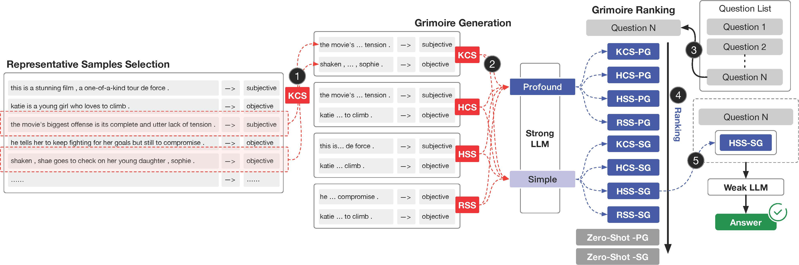

# Qingchen Yu

    

        
    

    

        

I'm currently a third-year master's student at the School of Management, Shanghai University. I previously obtained my Bachelor of Management in E-commerce from Henan University of Economics and Law in July 2022. 

​            <strong>Email:</strong> zhgyqc[at]163[dot]com
        

    

    <a href="https://scholar.google.com/citations?user=-soHkFYAAAAJ&hl=zh-CN">Google Scholar</a> | <a href="https://www.semanticscholar.org/author/Qingchen-Yu/2278590555">Semantic Scholar</a> | <a href="https://github.com/Duguce">GitHub</a> | <a href="https://huggingface.co/Duguce">Hugging Face</a> | <a href="https://x.com/zhgyqc_duguce">Twitter</a> | <a href="https://blog.csdn.net/LIGHTER_06">CSDN</a>

<h2 style="text-align: left;">Research Interests</h2>
My main interests are in machine learning and natural language processing. Currently, my research focuses on the reliable evaluation of large language models (LLMs).

<h2 style="text-align: left;">Selected Publications</h2>

    * Contributed Equally; † Corresponding Author

    

        
    

    

        

            <strong>TurtleBench: Evaluating Top Language Models via Real-World Yes/No Puzzles</strong> 
            <strong>Qingchen Yu</strong>*, Shichao Song*, Ke Fang*, Yunfeng Shi, Zifan Zheng, Hanyu Wang, Simin Niu, Zhiyu Li† 
            arXiv, 2024. <a href="https://arxiv.org/pdf/2410.05262">PDF</a> | <a href="https://github.com/mazzzystar/TurtleBench">Code</a> | <a href="https://huggingface.co/datasets/Duguce/TurtleBench1.5k">Dataset</a>
        

    

    

        
    

    

        

            <strong>Internal Consistency and Self-Feedback in Large Language Models: A Survey</strong> 
            Xun Liang*, Shichao Song*, Zifan Zheng*, Hanyu Wang, <strong>Qingchen Yu</strong>, Xunkai Li, Rong-Hua Li, Feiyu Xiong, Zhiyu Li† 
            arXiv, 2024. <a href="https://arxiv.org/pdf/2407.14507">PDF</a> | <a href="https://github.com/IAAR-Shanghai/ICSFSurvey">Code</a>
        

    

    

        
    

    

        

            <strong>xFinder: Robust and Pinpoint Answer Extraction for Large Language Models</strong> 
            <strong>Qingchen Yu</strong>*, Zifan Zheng*, Shichao Song*, Zhiyu Li†, Feiyu Xiong, Bo Tang, Ding Chen 
            arXiv, 2024. <a href="https://arxiv.org/pdf/2405.11874">PDF</a> | <a href="https://github.com/IAAR-Shanghai/xFinder">Code</a> | <a href="https://huggingface.co/collections/IAAR-Shanghai/xfinder-664b7b21e94e9a93f25a8412">Models</a>
        

    

    

        
    

    

        

            <strong>Grimoire is All You Need for Enhancing Large Language Models</strong> 
            Ding Chen*, Shichao Song*, <strong>Qingchen Yu</strong>, Zhiyu Li†, Wenjin Wang, Feiyu Xiong, Bo Tang 
            arXiv, 2024. <a href="https://arxiv.org/pdf/2401.03385">PDF</a> | <a href="https://github.com/IAAR-Shanghai/Grimoire">Code</a>
        

    

<h2 style="text-align: left;">Honors and Awards</h2>

<ul>
  <li style="font-size: 18px;">Outstanding Graduate Award of Henan (2022)</li>
  <li style="font-size: 18px;">National Scholarship for Undergraduate Students (2021)</li>
  <li style="font-size: 18px;">National Second Prize in the China Undergraduate Mathematical Contest in Modeling (2020)</li>
</ul>

<h2 style="text-align: left;">Academic Service</h2>

<ul>
  <li style="font-size: 18px;">Reviewer for ICLR (2025)</li>
</ul>